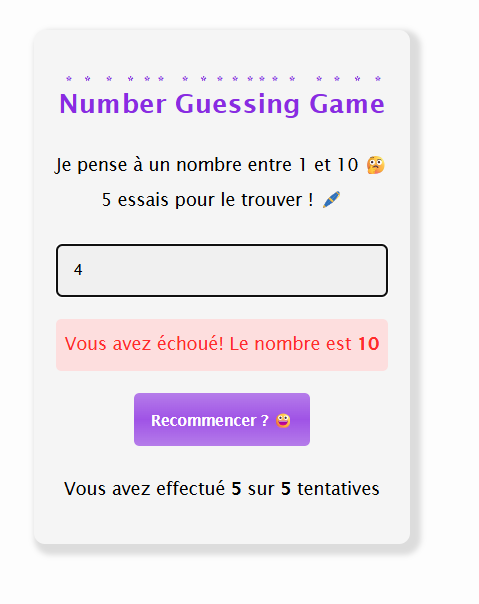

# Number Guessing Game

## Objectif et Fonctionnement

Un simple jeu réalisé en ***`HTML`***, ***`CSS`*** et ***`JavaScript`*** qui demande à l'utilisateur de deviner un nombre entre 1 et 10 en utlisant seulement 5 essais.

En fonction de la réponse de l'utilisateur, il est orienté à choisir un nombre supérieur ou inférieur au nombre qu'il a choisis, jusqu'à ce qu'il trouve le nombre en question.

Allez-vous parvenir à trouver le nombre ? A vous de jouer ! [Cliquez ici !!!](https://guess-game-chi-jade.vercel.app/)

## Rendu Final

    
    

