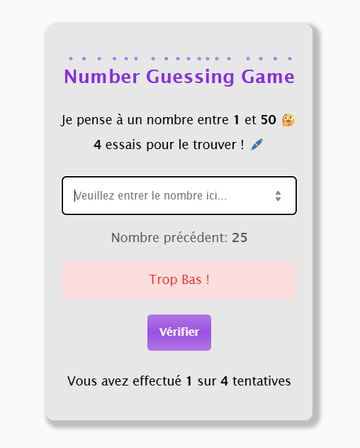
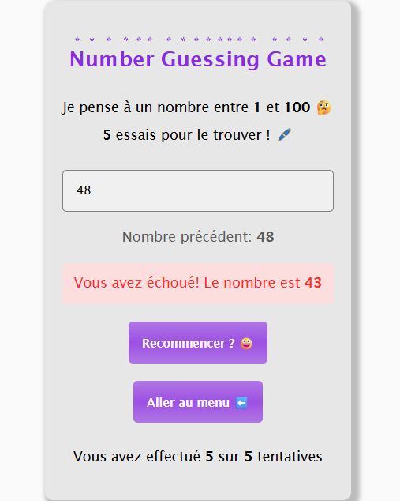

# Number Guessing Game

## Objectif et Fonctionnement

Un simple jeu réalisé en ***`HTML`***, ***`CSS`*** et ***`JavaScript`*** qui demande à l'utilisateur de deviner un nombre.

En fonction de la réponse de l'utilisateur, il est orienté à choisir un nombre supérieur ou inférieur au nombre qu'il a choisis, jusqu'à ce qu'il trouve le nombre en question.

Le jeu est constituer de *3* niveaux, qui sont :

- ***Facile :*** Trouver un nombre entre **1** et **10** en **3** tentatives.
- ***Intermédiaire :*** Trouver un nombre entre **1** et **50** en **4** tentatives.
- ***Difficile :*** Trouver un nombre entre **1** et **100** en **5** tentatives.

Allez-vous parvenir à trouver le nombre ? A vous de jouer ! [Cliquez ici !!!](https://guess-game-chi-jade.vercel.app/)

## Rendu Final

    
    

    
    

